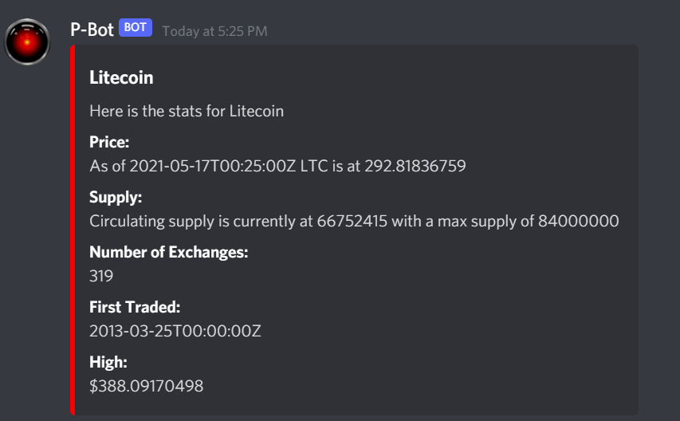

## Just a random discord bot

It currently has the following commands:

* `!sum` followed by numbers with spaces.

    * Ex: `!sum 5 5` will return 10.

* `!difference` followed by numbers with spaces.

    * Ex: `!difference 5 5` will return 0.

* `!product` followed by numbers with spaces.

    * Ex: `!product 5 5` will return 25.

* `!quotient` followed by numbers with spaces.

    * Ex: `!quotient 5 5` will return 1.

* `!poke` followed by a single number below 899 with.

    * Ex: `!quotient 94` will return:

        * .

* `!crypto` followed by a crypto symbol

    * Ex: `!crypto ltc` will return:
    
        * .

## Side notes

* This has zero error handling as of right now so don't expect anything fancy.

* Comment in the `PokeFinder` and `MathSolver` inside the `index.js` file if you wish to use em.